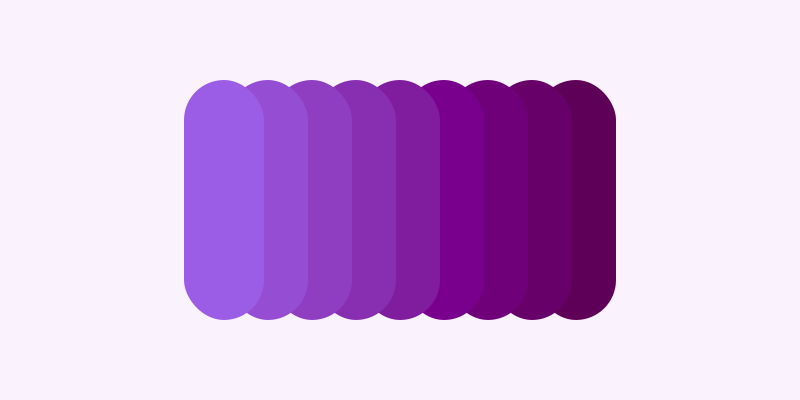

# Gradis

   

<p align="center">
  
</p>

CLI-утилита для генерации обоев в разрешении 10K на основе цветового пространства OKLCH. Поддерживает автоматическую установку изображений на рабочий стол macOS.

## Системные требования

**Важно:** Для работы программы в системе обязательно должна быть установлена утилита `rsvg-convert`. Она отвечает за финальный рендеринг SVG в PNG. Без неё генерация файла завершится ошибкой.

* **macOS:** `brew install librsvg`

## Использование

```bash
gradis generate <hex-color> [options]
```

### Доступные опции:
* `--steps`, `-s` — Количество цветов в градиенте (по умолчанию: 7).
* `--dark`, `-d` — Использовать темную тему для фона.
* `--skip-bg` — Только сгенерировать файл, не устанавливая его как обои.
* `--skip-cl` — Не удалять промежуточный svg.
* `--style` — Стратегия генерации палитры: `analogous` (по умолчанию), `mono`, `comp`.
* `--out`, `-o` — Путь для сохранения файла (по умолчанию генерируется автоматически).

## Сборка

Для компиляции нативного бинарного файла используйте:
```bash
sbt nativeImage
```
Результат будет сохранен в директории `target/native-image/`.
