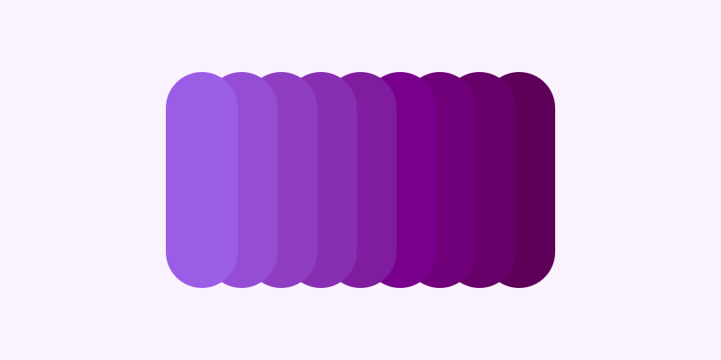

# Gradis

  

**Поддерживаемые окружения:**
   

<p align="center">
  
</p>

CLI-утилита для генерации обоев в разрешении 10K на основе цветового пространства OKLCH. Поддерживает автоматическую установку изображений на рабочий стол **macOS, Windows и Linux** (GNOME, KDE Plasma) с автоматическим определением окружения.

## Установка

**Linux / macOS:**
```bash
curl -fsSL https://raw.githubusercontent.com/ffebr/gradis/main/scripts/install.sh | bash
```

**Windows (PowerShell):**
```powershell
irm https://raw.githubusercontent.com/ffebr/gradis/main/scripts/install.ps1 | iex
```

Либо скачайте готовый бинарник для своей ОС со страницы [Releases](https://github.com/ffebr/gradis/releases).

## Системные требования

**Важно:** Для работы программы в системе обязательно должна быть установлена утилита `rsvg-convert`. Она отвечает за финальный рендеринг SVG в PNG. Без неё генерация файла завершится ошибкой.

* **macOS:** `brew install librsvg`
* **Linux (Debian/Ubuntu):** `sudo apt install librsvg2-bin`
* **Linux (Fedora):** `sudo dnf install librsvg2-tools`
* **Windows:** `scoop install librsvg` или `choco install rsvg-convert`

## Поддерживаемые окружения

| ОС | Окружение | Способ установки обоев | Определяется по |
| --- | --- | --- | --- |
| macOS | — | `osascript` | `os.name`, наличие `osascript` |
| Windows | — | `SystemParametersInfo` через PowerShell | `os.name` |
| Linux | GNOME / Unity / Cinnamon | `gsettings` | `XDG_CURRENT_DESKTOP`, наличие `gsettings` |
| Linux | KDE Plasma | `plasma-apply-wallpaperimage` | `XDG_CURRENT_DESKTOP`, наличие `plasma-apply-wallpaperimage` |

Нужное окружение выбирается автоматически. Если подходящего бэкенда нет, используйте `--skip-bg`, чтобы только сгенерировать файл.

## Использование

### Первый запуск (macOS)
Так как бинарный файл не имеет цифровой подписи Apple, при первом запуске система может его заблокировать. Скрипт `install.sh` снимает флаг карантина автоматически. Если же вы скачали бинарник вручную со страницы Releases — выполните команду в терминале:

```bash
xattr -d com.apple.quarantine ./gradis-macos-arm64
```

### Базовый синтаксис
```bash
gradis generate [options] <hex-color>
```
> Опции указывайте **перед** цветом — иначе они будут проигнорированы (особенность zio-cli).

Например:
```bash
gradis generate --dark --style comp "#9B5DE5"
```

### Доступные опции:
* `--steps`, `-s` — Количество цветов в градиенте (по умолчанию: 7).
* `--dark`, `-d` — Использовать темную тему для фона.
* `--skip-bg` — Только сгенерировать файл, не устанавливая его как обои.
* `--skip-cl` — Не удалять промежуточный svg.
* `--style` — Стратегия генерации палитры: `analogous` (по умолчанию), `mono`, `comp`.
* `--out`, `-o` — Путь для сохранения файла (по умолчанию генерируется автоматически).

## Сборка

Для компиляции нативного бинарного файла используйте:
```bash
sbt nativeImage
```
Результат будет сохранен в директории `target/native-image/`.

## Добавление своего окружения

Установка обоев построена как мини-фреймворк: один трейт `WallpaperSetter` и реестр
`WallpaperService.registry`. Каждый бэкенд декларативно описывает, **когда** он подходит
(через `Detection`), а нужный выбирается автоматически по самому специфичному совпадению.

Чтобы поддержать своё окружение (например, тайловый WM с `feh` или `swaybg`), добавьте
один объект и впишите его в реестр — больше ничего менять не нужно:

```scala
object SwaybgSetter extends WallpaperSetter:
  val name = "swaybg"
  val detection = Detection(
    os = Set(Os.Linux),
    envMatches = List(EnvMatch("XDG_CURRENT_DESKTOP", _.toLowerCase.contains("sway"))),
    requiredCommands = List("swaybg")
  )
  def setWallpaper(absolutePath: String) =
    SysIO.runProcess(Seq("swaybg", "-i", absolutePath, "-m", "fill"))

// затем в WallpaperService.registry:
// List(MacOsSetter, WindowsSetter, KdeSetter, GnomeSetter, SwaybgSetter)
```

Критерии `Detection`:
* `os` — допустимые ОС (пусто = любая);
* `envMatches` — переменные окружения и предикаты на их значения;
* `requiredCommands` — утилиты, которые должны быть в `PATH`.

Если совпадают несколько бэкендов, выбирается тот, у кого выше `specificity`
(сумма заданных критериев).
